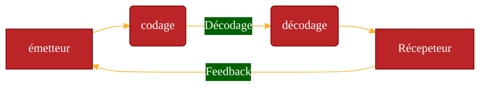

La communication est souvent envisagée dans sa seule dimension opérationnelle, au service de la stratégie des entreprises et des organisations. Elle doit pourtant aussi son développement et la structuration de ses pratiques à des grands penseurs qui, depuis des siècles, proposent des grilles de lecture et des analyses de son fonctionnement et de ses effets.
Quelles théories essentielles ont marqué l’histoire de la communication ? Quels chercheurs et intellectuels en ont bâti les fondements et déroulé les théories ?

## PENSER LA COMMUNICATION : D’ARISTOTE AUX SIC
La capacité des hommes à échanger des informations à l’aide du langage articulé ou d’autres codes (ton de la voix, gestes, regard, respiration, etc.) fascine philosophes et scientifiques depuis toujours. En 350 avant Jésus-Christ, Aristote est le premier à établir un modèle de communication orale, fondé sur un ensemble théorique, avec une visée morale : la « rhétorique » ou « art oratoire ». Le philosophe grec construit ce modèle autour de trois éléments : l’ethos (le style pris par l’orateur pour capter l’attention et la confiance de l’auditoire), le logos (la logique, le raisonnement, l’argumentation) et le pathos (la sensibilité de l’auditoire).
Aujourd’hui, théoriser la communication est l’objectif des Sciences de l’Information et de la Communication (SIC). Celles-ci aident à conceptualiser les phénomènes sociaux qui ont des répercussions dans la sphère de l’information et de la communication. À l’heure où connaître, comprendre et anticiper les courants socioculturels est une nécessité pour les communicants, les travaux des chercheurs et des théoriciens invitent à prendre conscience de la complexité d’objets, de processus, de pratiques et de représentations liée à ces disciplines. Cette prise de conscience garantit aux professionnels une meilleure maîtrise de leurs projets. Il faut en effet pouvoir cerner les embûches, les obstacles et les enjeux de prime abord invisibles pour imaginer et mettre en œuvre des idées performantes.
Mais avant cela, il convient de ne pas succomber à la tentation d’une approche théorique unique ! Chaque théorie peut délivrer une clé explicative utile et différentes théories peuvent s’articuler pour éclairer une même problématique.
Les SIC renferment des champs extrêmement vastes qu’il est difficile de catégoriser, tant leurs dimensions s’imbriquent les unes dans les autres. « Ces sciences recherchent, observent, classent et interprètent les phénomènes d’échange, de partage, de diffusion d’informations et de savoirs, de controverses qui contribuent au vivre ensemble. Les phénomènes qu’elles observent sont notamment : des instruments et leurs usages, des pratiques fonctionnelles et symboliques, des langages, des dispositifs, des circulations d’informations et de savoirs, des polémiques, des stratégies et des politiques1 ». À la croisée de plusieurs disciplines, les Sciences de l’Information et de la Communication se construisent au fil du temps et des recherches. Ce premier chapitre traite des principales visions, approches et théories indispensables à l’étudiant en communication et qui peuvent également nourrir les réflexions et les pratiques des professionnels.
## LES ANCIENS TOUJOURS MODERNES
### L’héritage du modèle cybernéticien et de la théorie mathématique de l’information
À la fin des années 1940, les États-Unis entrent dans la Guerre froide qui prendra fin au début des années 1990. Dans ce contexte d’affrontement mondial de deux blocs, la communication s’affirme plus que jamais comme une préoccupation dominante pour les états-majors et les chercheurs nord-américains. À travers elle, il s’agit de développer la propagande et les infrastructures de communication. La cybernétique et les théories mathématiques de l’information se développent dans ce climat d’effort de guerre, tandis que la télévision fait son apparition aux côtés des autres médias de masse que sont la presse, la réclame et la radio.
#### Norbert Wiener et la notion de feedback (1948)
Les premières théories de la communication se positionnent par rapport aux travaux des cybernéticiens, au premier rang desquels l’auteur de Cybernétique et société : Norbert Wiener (1894-1964). En 1948, ce mathématicien américain fonde la cybernétique ou « science du contrôle des systèmes ». Un système cybernétique se définit comme un ensemble d’éléments en interaction, il peut être vivant ou non-vivant. La société, une économie, un individu, une cellule, un cerveau ou un ordinateur sont des exemples de systèmes tels que définis par la cybernétique.
Ainsi, pour n’importe quel type d’organisation (sociale, biologique, technologique, etc.), l’approche cybernétique consiste en une analyse globale des éléments en présence et surtout de leurs interactions : l’action d’un élément sur un autre entraîne en retour une réponse (rétroaction ou feedback) du second élément vers le premier. On dit alors que ces deux éléments sont reliés par une boucle de feedback (ou boucle de rétroaction). Le grand apport de Wiener aux théories de la communication est cette notion de feedback. Il distingue deux types de feedback : le feedback positif qui conduit à accentuer un phénomène(les réactions du récepteur renforcent l’attitude de l’émetteur) et le feedback négatif où les réactions du récepteur conduisent l’émetteur à se corriger.

La boucle de feedback ou « boucle de rétroaction »
    

